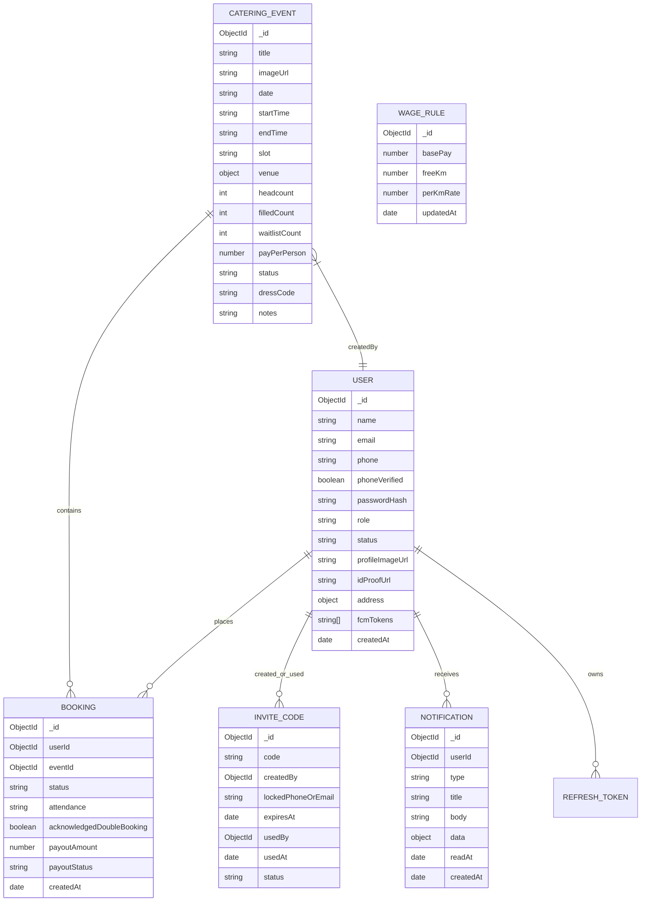

# Tebeya Services - API Server Architecture & Specification

**Service:** `@tebeya/api`  
**Platform:** Node.js, Express, TypeScript, MongoDB (Mongoose)  
**Version:** 1.0.0  
**Status:** Active Design & Specification  

---

## 1. Executive Summary

`@tebeya/api` is the core backend service powering the **Tebeya Services Catering Staff Booking Platform**. Tebeya provides trained, uniformed catering serving staff to large-scale events (weddings, banquets, corporate dinners). 

The API server is responsible for:
- Enforcing **restricted, invite-only onboarding** using single-use, admin-generated invite codes.
- Managing staff lifecycle, phone verification, and private KYC/ID proof storage.
- Administering event lifecycle (creation, slot assignment, publishing, capacity control, and cancellation).
- Executing **atomic seat reservations** with zero-overbooking guarantees under high concurrency.
- Enforcing **hard schedule conflict checks**, **daily 2-event limits**, and **travel gap buffers**.
- Calculating distance-based wage rules and tracking attendance/payout statuses.
- Broadcasting automated push notifications (via FCM) and managing an in-app notification inbox.

---

## 2. Technology Stack & Infrastructure

```
+-----------------------------------------------------------------------------------+
|                                  CLIENT CLIENTS                                   |
|   Staff Mobile App (React Native/Expo)   |    Web Admin Panel (React/Vite/TanStack)|
+------------------------------------------+----------------------------------------+
                                        | (HTTPS / JSON REST)
                                        v
+-----------------------------------------------------------------------------------+
|                             API GATEWAY & MIDDLEWARE                              |
|   Express 4.x + CORS + Helmet + Morgan + Rate Limiting + Zod Request Validation   |
|   JWT Authentication (Access & Refresh Tokens) + Role-Based Access Control (RBAC) |
+-----------------------------------------------------------------------------------+
                                        |
                                        v
+-----------------------------------------------------------------------------------+
|                                BUSINESS DOMAIN                                    |
|   Auth & Invites | Staff & KYC | Events | Booking & Clash Engine | Attendance & Pay|
+-----------------------------------------------------------------------------------+
            |                               |                           |
            v                               v                           v
+-----------------------+       +-----------------------+   +-----------------------+
|  MongoDB / Mongoose   |       | Cloudinary (Private)  |   |     Firebase FCM      |
|  Transactional Data   |       | ID Proofs & Images    |   | Push Notifications    |
+-----------------------+       +-----------------------+   +-----------------------+
```

### Core Technologies

| Layer / Concern | Technology | Version | Purpose & Rationale |
|---|---|---|---|
| **Runtime** | Node.js | `>=20.x LTS` | Predictable, cross-platform JavaScript/TypeScript runtime. |
| **Framework** | Express.js | `^4.21.2` | Lightweight, unopinionated HTTP routing and middleware framework. |
| **Language** | TypeScript | `^5.7.3` | Type-safe development with strict type checking across the monorepo. |
| **Database** | MongoDB | `>=6.0` | Flexible document store supporting ACID multi-document transactions. |
| **ODM** | Mongoose | `^8.12.0` | Schema validation, business logic hooks, and query abstractions. |
| **Validation** | Zod | `^3.24.2` | Runtime request body, query, and parameter validation with TypeScript inference. |
| **Authentication** | JSON Web Tokens (`jsonwebtoken`) | `^9.0.2` | Stateless access tokens (`15m`) + persistent refresh tokens (`30d`). |
| **Password Security**| `bcryptjs` | `^3.0.3` | One-way password hashing with salt rounds = 12. |
| **Logging** | Morgan | `^1.10.0` | HTTP request logging (combined/dev formats). |
| **Media & KYC Storage**| Cloudinary Private Assets | v2 API | Authenticated asset storage with signed, short-lived URLs for staff ID proofs. |
| **Push Notifications**| Firebase Cloud Messaging (FCM) | Admin SDK | Server-to-device push dispatching for Android and iOS. |
| **Development Runner**| `tsx` | `^4.19.3` | Instant TypeScript execution with hot watch reloading. |

---

## 3. High-Level Architecture & Layered Design

The API is architected with clear separation of concerns across 5 primary layers:

```
src/
├── config/              # Environment variables, database connection, 3rd party clients
├── constants/           # HTTP status codes, error definitions, system defaults
├── controllers/         # HTTP request extractors, status code handlers, response formatters
├── middleware/          # Auth guards, role checks, validation, rate limiting, error handlers
├── models/              # Mongoose schemas, document interfaces, indexes
├── routes/              # Express router definitions and middleware chaining
├── services/            # Pure business logic, transaction management, clash algorithms
├── utils/               # Geolocation/Haversine math, JWT helpers, date formatting
├── app.ts               # Express application initialization and middleware pipeline
└── server.ts            # Process bootstrap, DB connection, and HTTP listener
```

### Layer Responsibilities

1. **Routing Layer (`/routes`)**: Defines REST URI paths, maps HTTP verbs, and chains middleware (RateLimit -> Auth -> RBAC -> Validation -> Controller).
2. **Controller Layer (`/controllers`)**: Extracts `req.body`, `req.params`, `req.query`, and `req.user`. Delegates to services and formats uniform JSON responses.
3. **Service Layer (`/services`)**: Implements business rules (e.g. clash validation, wage calculation, atomic seat updates). Keeps controllers free of business logic.
4. **Data Access Layer (`/models`)**: Houses Mongoose schemas, custom query helpers, compound indexes, and document sanitizers.
5. **Middleware Layer (`/middleware`)**: Handles cross-cutting concerns:
   - `authMiddleware`: Validates `Authorization: Bearer <token>` and attaches authenticated user.
   - `requireRole(roles)`: Enforces role permissions (`staff` vs `admin`).
   - `validateRequest(schema)`: Validates input against Zod schemas, returning `400 Bad Request` with structured error maps on validation failure.
   - `errorHandler`: Global catch-all handler ensuring standard JSON error responses without stack trace leaks in production.

---

## 4. System Data Model & Database Schemas

### Entity Relationship Diagram



### Detailed Schema Specifications

#### 1. `User` Schema
- `_id`: `ObjectId`
- `name`: `String` (Required, trim, max 100)
- `email`: `String` (Required, unique, lowercase, index)
- `phone`: `String` (Required, unique, index)
- `phoneVerified`: `Boolean` (Default `false`)
- `passwordHash`: `String` (Required, excluded from default queries)
- `role`: `String` (`'staff' | 'admin'`, Default `'staff'`, index)
- `status`: `String` (`'pending_verification' | 'active' | 'suspended'`, Default `'pending_verification'`, index)
- `profileImageUrl`: `String` (Optional, Cloudinary URL)
- `idProofUrl`: `String` (Optional, Cloudinary private asset identifier)
- `address`:
  - `text`: `String`
  - `lat`: `Number`
  - `lng`: `Number`
  - `confirmed`: `Boolean` (Default `false`)
- `fcmTokens`: `[String]` (Set of active device registration tokens)
- `timestamps`: `{ createdAt, updatedAt }`

#### 2. `InviteCode` Schema
- `_id`: `ObjectId`
- `code`: `String` (Required, unique, uppercase, index)
- `createdBy`: `ObjectId` (Ref `User`, admin who generated)
- `lockedPhoneOrEmail`: `String` (Optional, restricts redemption to a specific phone or email)
- `expiresAt`: `Date` (Required, TTL candidate or soft check)
- `usedBy`: `ObjectId` (Ref `User`, set on redemption)
- `usedAt`: `Date` (Set on redemption)
- `status`: `String` (`'active' | 'used' | 'expired' | 'revoked'`, Default `'active'`, index)
- `timestamps`: `{ createdAt, updatedAt }`

#### 3. `CateringEvent` Schema
- `_id`: `ObjectId`
- `title`: `String` (Required, trim)
- `imageUrl`: `String` (Optional)
- `date`: `String` (Required, format: `YYYY-MM-DD`, index)
- `startTime`: `String` (Required, format: `HH:mm`)
- `endTime`: `String` (Required, format: `HH:mm`)
- `slot`: `String` (`'breakfast' | 'lunch' | 'snacks' | 'dinner' | 'custom'`, index)
- `venue`:
  - `text`: `String` (Required)
  - `lat`: `Number` (Optional)
  - `lng`: `Number` (Optional)
- `headcount`: `Number` (Required, positive integer)
- `filledCount`: `Number` (Default `0`, non-negative integer)
- `payPerPerson`: `Number` (Required, non-negative number)
- `status`: `String` (`'draft' | 'published' | 'completed' | 'cancelled'`, Default `'draft'`, index)
- `notes`: `String` (Optional)
- `dressCode`: `String` (Optional)
- `contactPerson`: `{ name: String, phone: String }` (Optional)
- `timestamps`: `{ createdAt, updatedAt }`

#### 4. `Booking` Schema
- `_id`: `ObjectId`
- `userId`: `ObjectId` (Ref `User`, Required, index)
- `eventId`: `ObjectId` (Ref `CateringEvent`, Required, index)
- `status`: `String` (`'confirmed' | 'waitlisted' | 'cancelled'`, Default `'confirmed'`, index)
- `attendance`: `String` (`'pending' | 'present' | 'absent' | 'late'`, Default `'pending'`, index)
- `acknowledgedDoubleBooking`: `Boolean` (Default `false`)
- `payoutAmount`: `Number` (Default `0`)
- `payoutStatus`: `String` (`'pending' | 'paid'`, Default `'pending'`, index)
- **Compound Unique Index**: `{ userId: 1, eventId: 1 }` (Unique constraint preventing duplicate records)
- `timestamps`: `{ createdAt, updatedAt }`

#### 5. `WageRule` Schema (Singleton or Versioned)
- `_id`: `ObjectId`
- `basePay`: `Number` (Default base shift pay)
- `freeKm`: `Number` (Threshold kilometers before travel pay applies, e.g. 15 km)
- `perKmRate`: `Number` (Pay per km exceeded, e.g. 10/km)
- `updatedAt`: `Date`

#### 6. `Notification` Schema
- `_id`: `ObjectId`
- `userId`: `ObjectId` (Ref `User`, Required, index)
- `type`: `String` (`'event_published' | 'event_updated' | 'event_cancelled' | 'seat_opened' | 'event_reminder' | 'account_verified' | 'payment_marked'`)
- `title`: `String` (Required)
- `body`: `String` (Required)
- `data`: `Record<string, unknown>` (Optional payload with eventId, bookingId, etc.)
- `readAt`: `Date` (Optional, null if unread)
- `timestamps`: `{ createdAt, updatedAt }`

---

## 5. Core Business Engines & Algorithms

### 5.1 Hard Clash & Schedule Overlap Algorithm

When staff attempts to join an event, the API evaluates all other active (`status: 'confirmed'`) bookings for that user on the **same calendar date**.

Let:
- Target Event: $T = [T_{\text{start}}, T_{\text{end}}]$ on date $D$
- Existing Event $i$: $E_i = [E_{i,\text{start}}, E_{i,\text{end}}]$ on date $D$

#### Overlap Check:
Two intervals $[A_{\text{start}}, A_{\text{end}}]$ and $[B_{\text{start}}, B_{\text{end}}]$ overlap if and only if:
$$\text{Overlap}(A, B) \iff (A_{\text{start}} < B_{\text{end}}) \land (B_{\text{start}} < A_{\text{end}})$$

If any existing confirmed booking on date $D$ overlaps with $T$:
- **Action**: Immediately reject booking with HTTP `409 Conflict` and error code `SCHEDULE_CLASH`.

### 5.2 Daily Limit & Travel Gap Rule

Per PRD §5.3 (FR-11, FR-12):
1. **Daily Cap**: A staff member may join a maximum of **2 events per day**.
   - If user already has 2 confirmed events on date $D$ $\rightarrow$ Reject with `DAILY_EVENT_LIMIT_EXCEEDED`.
2. **Travel Gap Requirement**: If the user has 1 existing event $E_1$ on date $D$:
   - Let $\Delta t_{\text{gap}} = \min(|T_{\text{start}} - E_{1,\text{end}}|, |E_{1,\text{start}} - T_{\text{end}}|)$
   - If $\Delta t_{\text{gap}} < 120 \text{ minutes}$ (configurable 2-hour minimum travel gap):
     - Reject with `INSUFFICIENT_TRAVEL_GAP`.
3. **Double-Booking Disclaimer**: If taking a second non-overlapping event on the same day:
   - The user must explicitly pass `acknowledgedDoubleBooking: true` in the join request.
   - If `false` or missing $\rightarrow$ Reject with `DOUBLE_BOOKING_ACKNOWLEDGEMENT_REQUIRED`.

### 5.3 Atomic Seat Allocation & Overbooking Prevention

To prevent race conditions where multiple staff members press "Join" at the exact same millisecond when 1 seat remains:

```typescript
// Atomic decrement using conditional findOneAndUpdate
const event = await CateringEvent.findOneAndUpdate(
  {
    _id: eventId,
    status: 'published',
    $expr: { $lt: ['$filledCount', '$headcount'] }
  },
  {
    $inc: { filledCount: 1 }
  },
  { new: true, session }
);

if (!event) {
  // Event is either full or not published
  throw new AppError('EVENT_FULL', 'This event has reached full capacity.', 409);
}
```

If the event is full and waitlist is enabled:
- The user is placed in `status: 'waitlisted'`.
- If an active attendee leaves (`Leave Event`), the seat is freed and the earliest waitlisted user (`FIFO`) is auto-promoted to `'confirmed'`, triggering a push notification.

### 5.4 Travel Allowance Formula (Haversine Distance)

When staff sets a confirmed home address $(lat_u, lng_u)$ and the event venue has coordinates $(lat_v, lng_v)$:

$$\text{distanceKm} = 2 R \cdot \arcsin\left(\sqrt{\sin^2\left(\frac{\Delta \phi}{2}\right) + \cos(\phi_1)\cos(\phi_2)\sin^2\left(\frac{\Delta \lambda}{2}\right)}\right)$$
where $R = 6371\text{ km}$.

The travel payout is calculated as:
$$\text{TravelAllowance} = \max\left(0, \text{distanceKm} - \text{freeKm}\right) \times \text{perKmRate}$$
$$\text{EstimatedPayout} = \text{payPerPerson} + \text{TravelAllowance}$$

---

## 6. API Modules & Endpoints Catalog

### Summary Matrix

| Module | Route Prefix | Primary Consumers | Purpose |
|---|---|---|---|
| **Auth & Invites** | `/api/auth` | Mobile (Staff), Web (Admin) | Invite validation, registration, login, token refresh, password resets |
| **Admin Invites** | `/api/admin/invite-codes` | Web (Admin) | Code generation, status monitoring, revocation |
| **Users & KYC** | `/api/users` | Mobile, Web | Profile management, ID proof upload, address configuration |
| **Admin Users** | `/api/admin/users` | Web (Admin) | Staff approval/ban, mobile verification, KYC review |
| **Events** | `/api/events` | Mobile (Staff) | Event catalog, distance filtering, event details |
| **Admin Events** | `/api/admin/events` | Web (Admin) | Full event CRUD, capacity configuration, publishing/cancellation |
| **Bookings** | `/api/bookings` | Mobile (Staff) | Join/leave events, conflict validation, joined lists |
| **Admin Rosters** | `/api/admin/events/:id/roster` | Web (Admin) | Attendance marking, manual staff add/remove, CSV/PDF export |
| **Earnings & Pay**| `/api/earnings`, `/api/admin/payments` | Mobile, Web | Monthly breakdown, marking payments paid, bulk payout operations |
| **Notifications** | `/api/notifications` | Mobile (Staff) | In-app notification feed, read state tracking, FCM token registration |
| **System & Health**| `/api/health`, `/api/admin/settings` | Public, Admin | Health liveness probe, global wage and travel rule settings |

---

### Module 1: Authentication & Restricted Signup (`/api/auth`)

#### 1. Validate Invite Code
- **Method**: `POST`
- **Path**: `/api/auth/validate-invite`
- **Auth**: Public (Rate limited: 10 req/15min)
- **Description**: Validates that an invite code exists, is active, has not expired, and is not locked to another person.
- **Request Body**:
  ```json
  {
    "code": "TB-849201"
  }
  ```
- **Response (200 OK)**:
  ```json
  {
    "success": true,
    "data": {
      "valid": true,
      "code": "TB-849201",
      "expiresAt": "2026-10-03T11:00:00.000Z",
      "lockedTo": null
    }
  }
  ```
- **Error Codes**: `INVITE_NOT_FOUND` (404), `INVITE_EXPIRED` (400), `INVITE_ALREADY_USED` (400), `INVITE_REVOKED` (400).

#### 2. Staff Registration (With Invite Code)
- **Method**: `POST`
- **Path**: `/api/auth/register`
- **Auth**: Public
- **Description**: Registers a new staff account. Redeems and marks the invite code as used atomically.
- **Request Body**:
  ```json
  {
    "inviteCode": "TB-849201",
    "name": "Arjun Kumar",
    "email": "arjun@example.com",
    "phone": "+919876543210",
    "password": "SecurePassword123!"
  }
  ```
- **Response (201 Created)**:
  ```json
  {
    "success": true,
    "data": {
      "user": {
        "id": "651a2b...",
        "name": "Arjun Kumar",
        "email": "arjun@example.com",
        "phone": "+919876543210",
        "role": "staff",
        "status": "pending_verification",
        "phoneVerified": false
      },
      "tokens": {
        "accessToken": "eyJhbGciOi...",
        "refreshToken": "eyJhbGciOi..."
      }
    }
  }
  ```

#### 3. User Login
- **Method**: `POST`
- **Path**: `/api/auth/login`
- **Auth**: Public
- **Request Body**:
  ```json
  {
    "email": "arjun@example.com",
    "password": "SecurePassword123!"
  }
  ```
- **Response (200 OK)**:
  ```json
  {
    "success": true,
    "data": {
      "user": {
        "id": "651a2b...",
        "name": "Arjun Kumar",
        "role": "staff",
        "status": "active"
      },
      "tokens": {
        "accessToken": "eyJhbGciOi...",
        "refreshToken": "eyJhbGciOi..."
      }
    }
  }
  ```

#### 4. Refresh Access Token
- **Method**: `POST`
- **Path**: `/api/auth/refresh-token`
- **Auth**: Public
- **Request Body**:
  ```json
  {
    "refreshToken": "eyJhbGciOi..."
  }
  ```
- **Response (200 OK)**:
  ```json
  {
    "success": true,
    "data": {
      "accessToken": "eyJhbGciOi...",
      "refreshToken": "eyJhbGciOi..."
    }
  }
  ```

#### 5. Send Admin One-Time Password (`admin_web_controll_emails` Gated)
- **Method**: `POST`
- **Path**: `/api/auth/admin/send-otp`
- **Auth**: Public
- **Access Control**: Validates that email exists in server's `admin_web_controll_emails` comma-separated list.
- **Request Body**:
  ```json
  {
    "email": "admin@tebeya.services"
  }
  ```
- **Response (200 OK)**:
  ```json
  {
    "success": true,
    "message": "A 6-digit one-time password has been sent to your authorized email address."
  }
  ```

#### 6. Verify Admin OTP & Session Login
- **Method**: `POST`
- **Path**: `/api/auth/admin/verify-otp`
- **Auth**: Public
- **Request Body**:
  ```json
  {
    "email": "admin@tebeya.services",
    "otp": "839201"
  }
  ```
- **Response (200 OK)**:
  ```json
  {
    "success": true,
    "data": {
      "user": {
        "id": "67cb2a98f712a1...",
        "name": "Operations Dispatcher",
        "email": "admin@tebeya.services",
        "role": "admin",
        "status": "active"
      },
      "tokens": {
        "accessToken": "eyJhbGciOi...",
        "refreshToken": "eyJhbGciOi..."
      }
    },
    "message": "Admin verification successful"
  }
  ```

#### 7. Forgot Password Request
- **Method**: `POST`
- **Path**: `/api/auth/forgot-password`
- **Request Body**: `{ "email": "arjun@example.com" }`
- **Response (200 OK)**: `{ "success": true, "message": "Password reset instructions sent." }`

#### 8. Reset Password
- **Method**: `POST`
- **Path**: `/api/auth/reset-password`
- **Request Body**: `{ "token": "rst_xyz...", "newPassword": "NewSecurePassword123!" }`
- **Response (200 OK)**: `{ "success": true, "message": "Password reset successfully." }`

---

### Module 2: Admin Invite Codes Management (`/api/admin/invite-codes`)

#### 1. Generate Invite Code(s)
- **Method**: `POST`
- **Path**: `/api/admin/invite-codes`
- **Auth**: Admin (`role: 'admin'`)
- **Request Body**:
  ```json
  {
    "count": 1,
    "expiresInHours": 48,
    "lockedPhoneOrEmail": "+919876543210"
  }
  ```
- **Response (201 Created)**:
  ```json
  {
    "success": true,
    "data": [
      {
        "id": "651c3...",
        "code": "TB-982412",
        "expiresAt": "2026-10-03T11:21:00.000Z",
        "lockedPhoneOrEmail": "+919876543210",
        "status": "active"
      }
    ]
  }
  ```

#### 2. List Invite Codes
- **Method**: `GET`
- **Path**: `/api/admin/invite-codes`
- **Auth**: Admin
- **Query Params**: `status` (`active|used|expired|revoked`), `page` (default 1), `limit` (default 20)
- **Response (200 OK)**: Paginated list of invite codes with creator and redeemer details.

#### 3. Revoke Invite Code
- **Method**: `POST`
- **Path**: `/api/admin/invite-codes/:id/revoke`
- **Auth**: Admin
- **Response (200 OK)**: `{ "success": true, "message": "Code revoked successfully." }`

---

### Module 3: Users & Staff Management (`/api/users` & `/api/admin/users`)

#### 1. Get Current User Profile
- **Method**: `GET`
- **Path**: `/api/users/me`
- **Auth**: Staff / Admin
- **Response (200 OK)**: User profile including verification status, address, and profile photo.

#### 2. Update Profile & Home Address
- **Method**: `PATCH`
- **Path**: `/api/users/me`
- **Auth**: Staff / Admin
- **Request Body**:
  ```json
  {
    "name": "Arjun K.",
    "address": {
      "text": "12/4 Baker Street, Kochi, Kerala",
      "lat": 9.9312,
      "lng": 76.2673,
      "confirmed": true
    }
  }
  ```
- **Response (200 OK)**: Updated user object.

#### 3. Upload ID Proof / Profile Image (Signed Cloudinary URL)
- **Method**: `POST`
- **Path**: `/api/users/me/upload-signature`
- **Auth**: Staff / Admin
- **Description**: Generates an authenticated, signed Cloudinary upload ticket for direct secure client upload.
- **Request Body**:
  ```json
  {
    "assetType": "id_proof"
  }
  ```
- **Response (200 OK)**: Signed parameters for client-side direct upload to Cloudinary.

#### 4. Confirm ID Proof Uploaded
- **Method**: `POST`
- **Path**: `/api/users/me/confirm-id-proof`
- **Auth**: Staff / Admin
- **Request Body**: `{ "cloudinaryPublicId": "id_proofs/user_651a..." }`
- **Response (200 OK)**: `{ "success": true, "message": "ID submitted for review." }`

#### 5. Admin: List Staff
- **Method**: `GET`
- **Path**: `/api/admin/users`
- **Auth**: Admin
- **Query Params**: `status`, `search`, `page`, `limit`
- **Response (200 OK)**: Staff list with attendance stats, no-show counters, and KYC state.

#### 6. Admin: Get Staff Detail with Signed Private ID URL
- **Method**: `GET`
- **Path**: `/api/admin/users/:id`
- **Auth**: Admin
- **Response (200 OK)**: Full staff detail including a time-limited signed URL to view private ID proof.

#### 7. Admin: Update Staff Status (Verify / Suspend / Active)
- **Method**: `PATCH`
- **Path**: `/api/admin/users/:id/status`
- **Auth**: Admin
- **Request Body**:
  ```json
  {
    "status": "active",
    "phoneVerified": true
  }
  ```
- **Response (200 OK)**: Updated staff record.

---

### Module 4: Events Management (`/api/events` & `/api/admin/events`)

#### 1. List Available Events (Staff Catalog)
- **Method**: `GET`
- **Path**: `/api/events`
- **Auth**: Staff
- **Query Params**: `date` (`YYYY-MM-DD`), `slot`, `onlyOpen` (`true|false`)
- **Description**: Returns all published future events. If staff address is set, calculates straight-line or road distance.
- **Response (200 OK)**:
  ```json
  {
    "success": true,
    "data": [
      {
        "id": "651f8a...",
        "title": "Grand Royal Banquet - Wedding Reception",
        "imageUrl": "https://res.cloudinary.com/...",
        "date": "2026-10-15",
        "startTime": "18:00",
        "endTime": "23:00",
        "slot": "dinner",
        "venue": {
          "text": "Lulu Convention Center, Kochi",
          "lat": 10.0159,
          "lng": 76.3419
        },
        "headcount": 50,
        "filledCount": 38,
        "remainingSeats": 12,
        "payPerPerson": 800,
        "distanceKm": 14.2,
        "estimatedPayout": 800,
        "isJoined": false,
        "status": "published"
      }
    ]
  }
  ```

#### 2. Get Event Details
- **Method**: `GET`
- **Path**: `/api/events/:id`
- **Auth**: Staff
- **Response (200 OK)**: Detailed event record including dress code, notes, contact person, and booking status for the caller.

#### 3. Admin: Create Event
- **Method**: `POST`
- **Path**: `/api/admin/events`
- **Auth**: Admin
- **Request Body**:
  ```json
  {
    "title": "Corporate Gala Dinner",
    "date": "2026-10-20",
    "startTime": "17:00",
    "endTime": "22:00",
    "slot": "dinner",
    "venue": {
      "text": "Crown Plaza, Kochi",
      "lat": 9.9625,
      "lng": 76.3156
    },
    "headcount": 30,
    "payPerPerson": 750,
    "dressCode": "Black trousers, white shirt, black formal shoes",
    "notes": "Report at back entrance service gate 30 minutes prior.",
    "contactPerson": {
      "name": "Rahul (Event Lead)",
      "phone": "+919876500000"
    }
  }
  ```
- **Response (201 Created)**: Created event object with `status: 'draft'`.

#### 4. Admin: Publish Event
- **Method**: `POST`
- **Path**: `/api/admin/events/:id/publish`
- **Auth**: Admin
- **Description**: Transitions status from `draft` to `published`. Fires FCM broadcast notification to all active staff.
- **Response (200 OK)**: `{ "success": true, "status": "published" }`

#### 5. Admin: Update Event
- **Method**: `PATCH`
- **Path**: `/api/admin/events/:id`
- **Auth**: Admin
- **Description**: Updates event metadata. If time or venue changes, runs clash re-evaluation and notifies joined attendees.
- **Response (200 OK)**: Updated event object.

#### 6. Admin: Cancel Event
- **Method**: `POST`
- **Path**: `/api/admin/events/:id/cancel`
- **Auth**: Admin
- **Description**: Cancels event, cancels all confirmed bookings without penalty, and dispatches urgent push notifications.

---

### Module 5: Booking & Scheduling Engine (`/api/bookings`)

#### 1. Join Event (With Hard Clash Checking)
- **Method**: `POST`
- **Path**: `/api/bookings/join`
- **Auth**: Staff
- **Request Body**:
  ```json
  {
    "eventId": "651f8a...",
    "acknowledgedDoubleBooking": false
  }
  ```
- **Validation Pipeline**:
  1. Staff account must be `status: 'active'`.
  2. Event must be `published` and future-dated.
  3. User must not already have a confirmed or waitlisted booking for this event.
  4. Query existing confirmed events for user on this date.
  5. Check **hard time overlap**: if overlap exists $\rightarrow$ `409 Conflict (SCHEDULE_CLASH)`.
  6. Check **daily event count**: if already 2 confirmed $\rightarrow$ `409 Conflict (DAILY_EVENT_LIMIT_EXCEEDED)`.
  7. Check **travel buffer**: if 1 existing event, ensure $\ge 2\text{ hours}$ travel gap. If $< 2\text{ hours}$ $\rightarrow$ `409 Conflict (INSUFFICIENT_TRAVEL_GAP)`.
  8. If this is event #2 on the same day:
     - Check `acknowledgedDoubleBooking === true`. If `false` $\rightarrow$ `400 Bad Request (DOUBLE_BOOKING_ACKNOWLEDGEMENT_REQUIRED)`.
  9. Perform atomic seat reservation:
     - If seats available $\rightarrow$ `status: 'confirmed'`, increment `filledCount`.
     - If full $\rightarrow$ `status: 'waitlisted'`.
- **Response (201 Created)**:
  ```json
  {
    "success": true,
    "data": {
      "bookingId": "652a1...",
      "status": "confirmed",
      "eventId": "651f8a...",
      "acknowledgedDoubleBooking": false,
      "payoutAmount": 800,
      "message": "Shift joined successfully."
    }
  }
  ```

#### 2. Leave / Cancel Booking
- **Method**: `POST`
- **Path**: `/api/bookings/:id/leave`
- **Auth**: Staff
- **Request Body**: `{ "reason": "Medical emergency" }`
- **Rules**:
  - Enforce 24-hour cutoff rule prior to `startTime`.
  - If $< 24\text{ hours}$ before event $\rightarrow$ `403 Forbidden (CANCELLATION_CUTOFF_EXCEEDED)`. User must contact admin.
  - If valid $\rightarrow$ Mark booking `cancelled`, decrement `filledCount`.
  - Check waitlist for earliest applicant: auto-promote to `confirmed` and dispatch push notification.
- **Response (200 OK)**: `{ "success": true, "message": "Booking cancelled successfully." }`

#### 3. List My Bookings (Upcoming & Past)
- **Method**: `GET`
- **Path**: `/api/bookings/my-bookings`
- **Auth**: Staff
- **Query Params**: `type` (`upcoming|history`), `month` (`YYYY-MM`)
- **Response (200 OK)**: Array of user bookings joined with event details, attendance, and earnings.

---

### Module 6: Admin Roster & Attendance (`/api/admin/events/:id/roster`)

#### 1. View Event Roster
- **Method**: `GET`
- **Path**: `/api/admin/events/:id/roster`
- **Auth**: Admin
- **Response (200 OK)**:
  ```json
  {
    "success": true,
    "data": {
      "eventId": "651f8a...",
      "headcount": 50,
      "filledCount": 38,
      "waitlistCount": 3,
      "roster": [
        {
          "bookingId": "652a1...",
          "user": {
            "id": "651a2b...",
            "name": "Arjun Kumar",
            "phone": "+919876543210",
            "profileImageUrl": "https://..."
          },
          "status": "confirmed",
          "attendance": "present",
          "payoutAmount": 850,
          "payoutStatus": "paid"
        }
      ]
    }
  }
  ```

#### 2. Mark Attendance (Single or Batch)
- **Method**: `PATCH`
- **Path**: `/api/admin/events/:id/roster/attendance`
- **Auth**: Admin
- **Request Body**:
  ```json
  {
    "attendees": [
      { "bookingId": "652a1...", "attendance": "present" },
      { "bookingId": "652a2...", "attendance": "absent" }
    ]
  }
  ```
- **Response (200 OK)**: `{ "success": true, "updatedCount": 2 }`

#### 3. Export Roster (CSV / PDF)
- **Method**: `GET`
- **Path**: `/api/admin/events/:id/roster/export`
- **Auth**: Admin
- **Query Params**: `format` (`csv|pdf`)
- **Response (200 OK)**: Binary file stream (`Content-Type: text/csv` or `application/pdf`).

---

### Module 7: Earnings, Wages & Payouts (`/api/earnings` & `/api/admin/payments`)

#### 1. Staff Earnings Overview
- **Method**: `GET`
- **Path**: `/api/earnings/summary`
- **Auth**: Staff
- **Response (200 OK)**:
  ```json
  {
    "success": true,
    "data": {
      "totalEventsWorked": 24,
      "totalEarnings": 19200,
      "currentMonthEarnings": 4800,
      "pendingPayouts": 1600
    }
  }
  ```

#### 2. Staff Monthly Earnings History
- **Method**: `GET`
- **Path**: `/api/earnings/history`
- **Auth**: Staff
- **Query Params**: `month` (`YYYY-MM`)
- **Response (200 OK)**: List of completed events, payout amount, distance bonus, and status (`pending|paid`).

#### 3. Admin: Mark Bookings Paid (Batch)
- **Method**: `POST`
- **Path**: `/api/admin/payments/mark-paid`
- **Auth**: Admin
- **Request Body**:
  ```json
  {
    "bookingIds": ["652a1...", "652a2..."]
  }
  ```
- **Response (200 OK)**: `{ "success": true, "markedCount": 2 }` (Sends `payment_marked` push notification to staff).

---

### Module 8: Notifications & Push Engine (`/api/notifications`)

#### 1. Register / Update FCM Device Token
- **Method**: `POST`
- **Path**: `/api/notifications/fcm-token`
- **Auth**: Staff / Admin
- **Request Body**: `{ "token": "fcm_device_token_string..." }`
- **Response (200 OK)**: `{ "success": true }`

#### 2. Get In-App Notification Feed
- **Method**: `GET`
- **Path**: `/api/notifications`
- **Auth**: Staff / Admin
- **Query Params**: `page`, `limit`, `unreadOnly` (`true|false`)
- **Response (200 OK)**: Paginated notifications array.

#### 3. Mark Notification Read
- **Method**: `PATCH`
- **Path**: `/api/notifications/:id/read`
- **Auth**: Staff / Admin
- **Response (200 OK)**: `{ "success": true }`

---

### Module 9: System, Settings & Health Probe (`/api/health` & `/api/admin/settings`)

#### 1. Health Probe
- **Method**: `GET`
- **Path**: `/api/health`
- **Auth**: Public
- **Response (200 OK)**:
  ```json
  {
    "status": "ok",
    "timestamp": "2026-10-01T11:21:48.000Z",
    "uptime": 1420.5,
    "db": "connected"
  }
  ```

#### 2. Admin: Get System Wage & Distance Rules
- **Method**: `GET`
- **Path**: `/api/admin/settings/wage-rules`
- **Auth**: Admin
- **Response (200 OK)**: `{ "basePay": 750, "freeKm": 15, "perKmRate": 10 }`

#### 3. Admin: Update System Wage & Distance Rules
- **Method**: `PUT`
- **Path**: `/api/admin/settings/wage-rules`
- **Auth**: Admin
- **Request Body**:
  ```json
  {
    "basePay": 800,
    "freeKm": 15,
    "perKmRate": 12
  }
  ```
- **Response (200 OK)**: Updated settings object.

---

## 7. Standard Error Handling & Response Contract

All API responses follow a strict envelope schema:

### Success Envelope
```json
{
  "success": true,
  "data": { ... },
  "message": "Optional human-readable success note"
}
```

### Error Envelope
```json
{
  "success": false,
  "error": {
    "code": "SCHEDULE_CLASH",
    "message": "You already have a confirmed booking overlapping this time range.",
    "details": [ ... ]
  }
}
```

### Standard Error Codes

| HTTP Status | Error Code | Description |
|---|---|---|
| `400 Bad Request` | `VALIDATION_ERROR` | Request payload failed Zod schema validation. |
| `400 Bad Request` | `INVITE_EXPIRED` | Invite code has expired. |
| `400 Bad Request` | `DOUBLE_BOOKING_ACKNOWLEDGEMENT_REQUIRED` | Taking second event on same day requires explicit confirmation. |
| `401 Unauthorized` | `INVALID_CREDENTIALS` | Incorrect email or password. |
| `401 Unauthorized` | `TOKEN_EXPIRED` | JWT access token expired; use refresh token. |
| `403 Forbidden` | `ACCOUNT_PENDING_VERIFICATION` | User not approved yet by admin. |
| `403 Forbidden` | `ACCOUNT_SUSPENDED` | Staff account suspended due to infractions. |
| `403 Forbidden` | `CANCELLATION_CUTOFF_EXCEEDED` | Cannot leave event within 24 hours of start. |
| `404 Not Found` | `RESOURCE_NOT_FOUND` | Requested event, booking, or user not found. |
| `409 Conflict` | `SCHEDULE_CLASH` | Direct time overlap with an already joined event. |
| `409 Conflict` | `DAILY_EVENT_LIMIT_EXCEEDED` | Maximum of 2 events per day reached. |
| `409 Conflict` | `INSUFFICIENT_TRAVEL_GAP` | Less than 2 hours gap between events on the same day. |
| `409 Conflict` | `EVENT_FULL` | Event reached maximum capacity. |
| `429 Too Many Requests`| `RATE_LIMIT_EXCEEDED` | Rate limit breached on auth or invite verification. |
| `500 Internal Error`| `INTERNAL_SERVER_ERROR` | Unhandled server exception. |

---

## 8. Security, Privacy & Cloud Integrations

1. **KYC & ID Proof Security**:
   - ID proofs are stored in Cloudinary under private/authenticated mode.
   - Uploads occur directly from the client using signed tokens obtained from `POST /api/users/me/upload-signature`.
   - Admin access to ID images generates short-lived, signed URLs (`expiresIn: 300` seconds) to prevent unauthorized distribution.
2. **Password & JWT Security**:
   - Passwords hashed with `bcryptjs` (salt rounds = 12).
   - Access tokens have short TTLs (`15 minutes`); refresh tokens have `30-day` TTLs stored with user association.
3. **FCM Push Notification Handling**:
   - Device tokens are registered per user.
   - Stale or invalid tokens (`messaging/registration-token-not-registered`) are automatically pruned from the user's `fcmTokens` array.

---

## 9. Verification & Testing Strategy

- **Unit Testing**: Pure functions (Haversine math, time overlap intervals, date boundary checks).
- **Integration Testing**: Supertest against Express endpoints with in-memory MongoDB (`mongodb-memory-server`).
- **Concurrency Testing**: High-concurrency test simulating 20 simultaneous join requests for an event with 1 seat remaining to guarantee zero-overbooking.
