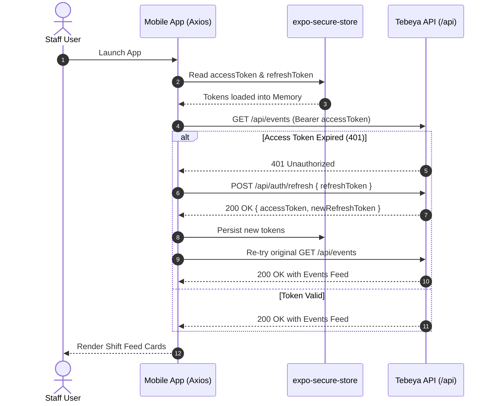

# Tebeya Services - Mobile App Architecture & Specification

**Service / Workspace:** `@tebeya/mobile`  
**Location:** `apps/mobile`  
**Platform:** React Native 0.76+, Expo SDK 52, Expo Router v4, NativeWind (Tailwind CSS v4/v3), TanStack Query v5, TypeScript  
**Version:** 1.0.0  
**Status:** Active Design & Specification  

---

## 1. Executive Summary & Purpose

`@tebeya/mobile` is the dedicated mobile client application for the **Tebeya Services Catering Staff Platform**. Tebeya operates a specialized hospitality service-staff business supplying trained, uniformed banquet servers, waiters, and event personnel to high-volume venues (weddings, banquets, conventions, and corporate galas).

Instead of relying on disorganized WhatsApp broadcasts and manual phone registries, the mobile application provides serving staff with an intuitive, reliable, and high-performance portal to:
1. **Onboard Securely:** Register strictly via admin-issued single-use invite codes.
2. **Discover & Book Shifts:** Browse published catering events, view accurate venue locations and distance-based travel bonuses, and join shifts with instant atomic seat reservation.
3. **Comply with Shift Discipline:** Adhere to clash constraints (zero time overlap, maximum 2 events per day with mandatory $\ge 2\text{h}$ travel buffer, and double-shift acknowledgement).
4. **Track Shifts & Earnings:** Maintain a live countdown of confirmed shifts, access venue navigation, view attendance statuses (`present`, `absent`, `late`), and reconcile transparent wage disbursements.
5. **KYC & Verification:** Upload private government ID proofs securely and track verification status.

---

## 2. Technology Stack & Key Dependencies

```
+-----------------------------------------------------------------------------------------+
|                                    USER INTERFACE                                       |
|    React Native 0.76 + Expo Router v4 (File-based) + NativeWind v4 (Tailwind CSS)       |
|    Lucide React Native Icons + React Native Reanimated + Expo Image (Cached)            |
+-----------------------------------------------------------------------------------------+
                                             |
                                             v
+-----------------------------------------------------------------------------------------+
|                             CLIENT-SIDE STATE & DATA LAYER                              |
|   TanStack Query v5 (Server Cache & Offline Persistence)  |  Zustand (Auth/UI State)    |
|   expo-secure-store (Encrypted JWT Storage)               |  React Hook Form + Zod      |
+-----------------------------------------------------------------------------------------+
                                             |
                                             v
+-----------------------------------------------------------------------------------------+
|                                  SHARED CONTRACT LAYER                                  |
|   @tebeya/shared (TypeScript Domain Models, ApiResponse<T>, ApiError, Enums)           |
+-----------------------------------------------------------------------------------------+
                                             | (REST / HTTPS with Bearer Auth)
                                             v
+-----------------------------------------------------------------------------------------+
|                                 BACKEND API GATEWAY                                     |
|   @tebeya/api (Express 4.x + MongoDB + Cloudinary Private + Firebase Cloud Messaging)   |
+-----------------------------------------------------------------------------------------+
```

### 2.1 Core Technology Breakdown

| Concern / Layer | Technology | Version | Rationale & Purpose |
|---|---|---|---|
| **Core Framework** | React Native | `0.76.x` | Modern New Architecture support, robust native bridge performance, cross-platform Android & iOS runtime. |
| **Platform Tooling** | Expo SDK | `~52.0.x` | Streamlined native module ecosystem, EAS build pipelines, instant updates, and managed push notifications. |
| **Routing & Navigation** | Expo Router | `~4.0.x` | Modern file-based routing matching modern Next.js/App Router mental models. Native stack transitions, deep linking, and type-safe route navigation. |
| **Styling & Design System**| NativeWind (Tailwind CSS) | `^4.0.x` / `tailwindcss ^3.4.x` | Utility-first styling compiled directly to React Native stylesheets. Consistent design tokens, rapid layout development, and responsive/dark mode support. |
| **Server State & Caching**| TanStack Query | `^5.67.x` | Server cache synchronization, optimistic updates for event joins, automatic background refetching, and offline cache persistence. |
| **Client & Session State**| Zustand | `^5.0.x` | Lightweight, non-boilerplate reactive store for authentication state, offline queue status, and notification flags. |
| **Secure Token Storage**| `expo-secure-store` | Latest | Hardware-backed encrypted key-value storage (Android Keystore / iOS Keychain) for JWT access and refresh tokens. |
| **Icons** | `lucide-react-native` | Latest | Standardized, modern icon set consistent with the Web Admin portal (`apps/web`). |
| **Asset & Image Handling**| `expo-image` | Latest | High-performance image component with disk and memory caching, blurhash placeholders, and smooth transitions. |
| **Hardware & Peripherals**| `expo-image-picker`, `expo-document-picker` | Latest | Capture camera photos or upload gallery documents for KYC ID proof and avatar photos. |
| **Location Services** | `expo-location` | Latest | Obtain coordinates for staff address geocoding and calculate distance/travel pay estimates. |
| **Push Notifications** | `expo-notifications` | Latest | Receive FCM push messages (new shifts, seat openings, 2-hour shift reminders, payment confirmations). |
| **Form Management** | `react-hook-form` + `@hookform/resolvers` + `zod` | Latest | Declarative, low-overhead form validation with typed schemas. |
| **Monorepo Shared Core** | `@tebeya/shared` | `workspace:*` | Single source of truth for domain types, API contracts, booking statuses, and clash rules. |

---

## 3. High-Level Architecture & Directory Structure

The mobile application utilizes the **Expo Router `app/` convention** with a feature-driven internal library directory (`src/`):

```
apps/mobile/
├── app/                                    # Expo Router File-Based Routing
│   ├── (auth)/                             # Authentication & Onboarding Route Group
│   │   ├── _layout.tsx                     # Auth Stack Layout (headerless transition)
│   │   ├── onboarding.tsx                  # 3-Slide introduction to Tebeya services
│   │   ├── login.tsx                       # Email & Password authentication
│   │   ├── signup.tsx                      # 2-Step restricted invite code registration
│   │   └── forgot-password.tsx             # Password recovery request
│   ├── (tabs)/                             # Primary Bottom Tab Navigation Group
│   │   ├── _layout.tsx                     # Tab bar layout (custom icons, badges, theme)
│   │   ├── index.tsx                       # Home / Shifts Discovery Screen
│   │   ├── shifts.tsx                      # My Upcoming Joined Shifts Screen
│   │   ├── earnings.tsx                    # History & Earnings Overview Screen
│   │   └── profile.tsx                     # Staff Profile & Account Settings Screen
│   ├── events/                             # Shift Details & Interaction Stack
│   │   ├── [id].tsx                        # Detailed Shift View (Pay, Venue, Join/Leave)
│   │   └── _layout.tsx                     # Modal / Stack transition configuration
│   ├── notifications.tsx                   # In-App Notification Center
│   ├── address-picker.tsx                  # Map / Coordinate Home Address Pin Modal
│   ├── kyc-upload.tsx                      # Private ID Proof Camera & Upload Modal
│   ├── _layout.tsx                         # Root Layout: Providers, Splash, Notifications
│   └── +not-found.tsx                      # 404 Route Fallback
├── src/                                    # Core Application Source Code
│   ├── api/                                # HTTP API Client & Endpoints
│   │   ├── client.ts                       # Axios / Fetch client with secure JWT refresh
│   │   ├── auth.api.ts                     # Login, register, invite verify, refresh
│   │   ├── events.api.ts                   # Fetch feed, shift details, join/leave actions
│   │   ├── profile.api.ts                  # Profile update, KYC upload, address save
│   │   ├── earnings.api.ts                 # Earnings summary & attendance history
│   │   └── notifications.api.ts            # Push token registration & inbox queries
│   ├── components/                         # Reusable UI Design System Primitives
│   │   ├── ui/                             # Atoms: Button, Input, Badge, Card, Avatar
│   │   ├── feedback/                       # Modals: DoubleBookingModal, ClashModal, Toast
│   │   ├── shifts/                         # ShiftCard, HeadcountBar, SlotBadge, PayoutBadge
│   │   └── layout/                         # ScreenWrapper, Header, OfflineBanner, EmptyState
│   ├── hooks/                              # Custom React Hooks
│   │   ├── useAuth.ts                      # Hook accessing Zustand Auth Store
│   │   ├── useShifts.ts                    # TanStack Query shift discovery & filtering
│   │   ├── useBookingMutation.ts           # Optimistic shift join/leave mutation
│   │   ├── useLocation.ts                  # Device GPS & geocoding helper
│   │   └── useNotifications.ts             # FCM setup, listeners, and badge counter
│   ├── store/                              # Client State Management (Zustand)
│   │   ├── authStore.ts                    # Current user, token memory, login/logout
│   │   └── uiStore.ts                      # Network connectivity, active filters
│   ├── utils/                              # Utility Functions
│   │   ├── clashEngine.ts                  # Local pre-validation for schedule conflicts
│   │   ├── distance.ts                     # Haversine distance & travel wage calculation
│   │   ├── formatters.ts                   # Date (YYYY-MM-DD), time (12h/24h), currency (₹/$)
│   │   └── secureStorage.ts                # Wrapper over expo-secure-store
│   └── constants/                          # App Constants
│       ├── theme.ts                        # Tebeya color tokens, spacing, typography
│       └── config.ts                       # API URL, Cloudinary upload endpoint, support phone
├── assets/                                 # Static Assets (Images, Icons, Fonts)
├── babel.config.js                         # Babel setup with NativeWind preset
├── metro.config.js                         # Metro bundler with NativeWind & monorepo support
├── tailwind.config.js                      # Tailwind CSS configuration for NativeWind
├── app.json                                # Expo configuration & plugins
├── package.json                            # Mobile package dependencies
└── tsconfig.json                           # TypeScript configuration
```

---

## 4. Comprehensive Route, Page & Section Specifications

### 4.1 Root Layout & Global Overlays (`app/_layout.tsx`)

The root layout wraps the entire application runtime and hosts all foundational providers and lifecycle hooks:
- **`QueryClientProvider`:** Configured with 5-minute stale-time and network reconnect refetching.
- **`AuthProvider`:** Initializes token hydration from `expo-secure-store` on app launch.
- **`NotificationManager`:** Hooks into `expo-notifications` to register FCM device tokens and handle foreground banner alerts.
- **`OfflineBanner`:** Persistent dismissible warning displayed at the top of the viewport when network connectivity is lost.
- **`SplashScreen`:** Controlled splash dismissal after token hydration and initial font rendering.

---

### 4.2 Authentication & Onboarding Group (`app/(auth)/`)

```mermaid
flowchart TD
    Launch[App Launch] --> CheckAuth{Token Valid in SecureStore?}
    CheckAuth -- Yes --> Tabs[(tabs)/index Feed]
    CheckAuth -- No --> CheckOnboard{First Launch?}
    CheckOnboard -- Yes --> Onboarding[onboarding.tsx: 3-Slide Carousel]
    CheckOnboard -- No --> Login[login.tsx: Email & Password]
    Onboarding --> Login
    Login --> Signup[signup.tsx: Invite Code + Registration]
    Signup --> VerifyCode{Verify Invite Code via API}
    VerifyCode -- Invalid/Used/Expired --> ErrorToast[Show Error Message]
    VerifyCode -- Valid --> CreateAccount[Submit Profile & Password]
    CreateAccount --> Tabs
```

#### Page 1: `(auth)/onboarding.tsx` (App Introduction Carousel)
* **Purpose:** Educate new catering staff members on how the platform operates.
* **Sections:**
  1. **Horizontal Carousel (3 Interactive Slides):**
     - *Slide 1: Premium Event Shifts:* Discover high-profile wedding, gala, and banquet shifts in your city.
     - *Slide 2: Instant Booking & Travel Allowance:* One-tap shift reservation with transparent base pay plus distance travel bonuses.
     - *Slide 3: Punctuality & Trust:* Clear reporting times, dress code requirements, and automated attendance and earnings tracking.
  2. **Pagination Indicator:** Animated dots indicating the current active slide.
  3. **Action Footer:** "Get Started" button (navigates to `signup.tsx`) and "I already have an account" link (navigates to `login.tsx`).

#### Page 2: `(auth)/login.tsx` (Staff Login)
* **Purpose:** Authenticate registered catering staff.
* **Sections:**
  1. **Brand Header:** Tebeya Services logo, welcoming subtitle.
  2. **Form Section:**
     - Email text input (with email format validation and auto-trimming).
     - Password text input (with secure text toggle).
     - "Forgot Password?" hyperlink leading to `forgot-password.tsx`.
  3. **Submit Action:** High-contrast primary action button ("Sign In") with loading spinner.
  4. **Signup Route Prompt:** "Invited by an admin? Enter your invite code to sign up" leading to `signup.tsx`.

#### Page 3: `(auth)/signup.tsx` (Restricted Invite-Only Registration)
* **Purpose:** Strictly enforce **Architectural Rule 3 (Invite-Only Onboarding)**. Users cannot create an account without an active, admin-issued invite code.
* **Sections (Two-Step Wizard):**
  - **Step 1: Invite Code Verification**
    - Code input: 6-8 character uppercase alphanumeric input field.
    - Info Callout: "Tebeya Services operates on an invite-only basis. Ask your event coordinator for an invite code."
    - "Verify Code" button: Calls `POST /api/invites/verify` to confirm that the code is active and not expired or previously redeemed.
  - **Step 2: Profile & Account Credentials (Unlocked upon code validation)**
    - Read-only Invite Code badge with green checkmark.
    - Full Name input.
    - Mobile Phone input (pre-filled and locked if the invite code was targeted to a specific phone number).
    - Email address input.
    - Password and Confirm Password inputs.
    - Terms & Punctuality Agreement checkbox.
    - "Create Staff Account" button: Calls `POST /api/auth/register` (atomically consumes the code and returns JWT session).

#### Page 4: `(auth)/forgot-password.tsx` (Password Recovery)
* **Purpose:** Allow staff to request a password reset link.
* **Sections:**
  1. Header with back button.
  2. Email input.
  3. "Send Reset Link" button: Calls `POST /api/auth/forgot-password`.
  4. Success confirmation banner advising the user to check their email inbox.

---

### 4.3 Primary Bottom Tab Navigation (`app/(tabs)/`)

The bottom tab navigator provides persistent, thumb-accessible navigation with custom icon states and dynamic badges.

```
+-----------------------------------------------------------------------------------------+
|                                    BOTTOM TAB BAR                                       |
|  [Home / Discover]       [My Shifts]         [Earnings & History]       [Profile]       |
|    (Shifts Feed)        (Upcoming: 2)         (Monthly Totals)        (KYC Status)      |
+-----------------------------------------------------------------------------------------+
```

---

#### Page 5: `(tabs)/index.tsx` (Home Feed & Shift Discovery)

The primary landing screen where staff view, filter, and discover open catering shifts.

```
+-----------------------------------------------------------------------------------------+
|  TOP BAR:  [Avatar]  Hi, Rahul!  (Status: Active)                     [Notification 🔔] |
+-----------------------------------------------------------------------------------------+
|  TODAY'S SHIFT ALERT: (If booked today)                                                 |
|  "Grand Hyatt Gala Banquet" | 18:00 - 23:00 | Reporting in 2h 15m        [View Details] |
+-----------------------------------------------------------------------------------------+
|  FILTER CHIPS:  [ All (12) ]  [ Breakfast ]  [ Lunch ]  [ Dinner ]  [ Nearby (<10km) ]  |
+-----------------------------------------------------------------------------------------+
|  OPEN SHIFTS FEED (Sorted chronologically):                                             |
|                                                                                         |
|  +-----------------------------------------------------------------------------------+  |
|  | [Event Image]   OCT 12, 2026 (SAT) • DINNER SLOT                                  |  |
|  | Royal Orchid Banquet - Grand Wedding Reception                                    |  |
|  | 📍 Palace Grounds, Gate 4 (5.2 km away)                                           |  |
|  | 🕒 17:00 - 23:30 (6.5 hrs)                                                         |  |
|  | 💰 ₹1,200 Base + ₹150 Travel = ₹1,350 Est. Total                                  |  |
|  | 👥 Headcount: 22 / 30 Filled  [=======---] (8 spots left)                         |  |
|  |                                                                                   |  |
|  | [ View Details & Book Shift ]                                                     |  |
|  +-----------------------------------------------------------------------------------+  |
+-----------------------------------------------------------------------------------------+
```

* **Section Breakdown:**
  1. **User Status Header:**
     - Left: Staff profile picture, greeting ("Hello, [First Name]"), and account status pill (`Active` / `Pending Verification`).
     - Right: Notification Bell icon with unread indicator badge.
  2. **Active Day Priority Banner (Conditional):**
     - Renders if the staff member is booked for a shift today.
     - Displays urgent countdown: "Shift starts in X hours at [Venue Name]". Tap opens shift details.
  3. **Slot & Category Filter Chips:**
     - Horizontal scrolling filter bar: `All`, `Breakfast`, `Lunch`, `Snacks`, `Dinner`, `Custom`.
     - "Sort by Distance" toggle (activates distance calculation using user's saved home address).
  4. **Upcoming Shifts Virtualized List (`FlashList` / `FlatList`):**
     - Pull-to-refresh (`RefreshControl`) triggering TanStack Query refetch.
     - **Shift Card Anatomy:**
       - Event cover image with Slot Badge overlay (`Dinner`, `Lunch`, etc.).
       - Date and Day pill (`OCT 12 • SAT`).
       - Event Title and Venue name with pin icon.
       - Distance indicator (e.g., `4.8 km from home`) calculated via Haversine formula against the user's saved address.
       - Shift Timing: `17:00 - 23:30`.
       - Pay Breakdown: Base Pay + Estimated Travel Bonus = Total Estimated Pay.
       - Headcount Capacity Progress Bar: Shows `filledCount` / `headcount` and remaining seats.
       - Shift Status Pill: `Open`, `Filling Fast` ($\ge 80\%$ full), or `Full (Waitlist Available)`.
       - Primary Action: "View Details & Book" button.
  5. **Empty State:**
     - Clean illustration, message: "No catering events currently published for this slot. Check back soon!"

---

#### Page 6: `(tabs)/shifts.tsx` (My Upcoming Shifts & Roster)

* **Purpose:** Dedicated hub for viewing all confirmed and waitlisted shifts the user has committed to work.
* **Sections:**
  1. **Segmented Tab Control:**
     - `Confirmed Shifts (N)`: Active bookings ready to work.
     - `Waitlisted (N)`: Shifts where the user is queued if a seat opens.
  2. **Shift Schedule Timeline:**
     - Chronological cards organized by date.
     - **Confirmed Shift Card Features:**
       - Event name, venue address, and date/time.
       - **Reporting Time Notice:** Highlights arrival time (typically 30 minutes before event start).
       - **Dress Code Reminder:** e.g., "Full black formal banquet attire: black trousers, polished black shoes, white ironed shirt".
       - **Action Bar:**
         - "Get Directions" button: Spawns native Google Maps / Apple Maps navigation link.
         - "Call Coordinator" button: Quick dial trigger to the event supervisor.
         - "Cancel Shift" button: Triggers leave confirmation. If within 24 hours of start time (cutoff), button is disabled and replaced by: "Late cancellation cutoff passed. Please contact your coordinator."
  3. **Waitlist Information Card:**
     - Shows current position on waitlist and automatic push notification reassurance if another staff member drops out.

---

#### Page 7: `(tabs)/earnings.tsx` (History & Earnings Dashboard)

* **Purpose:** Deliver transparent earnings summaries and historical attendance records to satisfy PRD Requirement FR-17 to FR-19.
* **Sections:**
  1. **Financial Overview Stats Grid:**
     - **Card 1: Total Lifetime Earnings** (e.g. `₹48,500`).
     - **Card 2: Current Month Earnings** (e.g. `₹12,400`).
     - **Card 3: Shifts Worked** (e.g. `34 Events`).
     - **Card 4: Pending Payouts** (e.g. `₹2,700` awaiting disbursement).
  2. **Month Selector & Filter Bar:**
     - Dropdown / horizontal scroll selector allowing staff to inspect past months (e.g. `October 2026`, `September 2026`).
  3. **Historical Shifts List:**
     - Each history entry details:
       - Date and Event Title.
       - Role / Slot: `Banquet Server • Dinner`.
       - Attendance Badge:
         - `Present` (Green): Full shift completed.
         - `Late` (Amber): Logged as late with notes.
         - `Absent` (Red): Unexcused absence.
       - Payment Status Badge:
         - `Paid` (Green checkmark): Transferred via bank/cash by coordinator.
         - `Pending` (Gray clock): Processing in current payout cycle.
       - Wage Breakdown: Base Shift Wage + Distance Travel Allowance.
  4. **Earnings Summary Footer:**
     - Clarification note: "Wages are reconciled weekly by the Tebeya administrative team following attendance verification."

---

#### Page 8: `(tabs)/profile.tsx` (Staff Profile & Settings)

* **Purpose:** Manage personal profile, upload secure KYC documents, save home address, and configure preferences.
* **Sections:**
  1. **Profile Header:**
     - Avatar image with edit camera overlay.
     - Full Name and Registered Email.
     - Mobile Number with Verification Status Pill (`Verified` badge or `Unverified`).
  2. **Account Status & KYC Verification Card:**
     - Displays account lifecycle status (`active`, `pending_verification`, `suspended`).
     - ID Proof Status:
       - *Not Uploaded:* Red warning with "Upload Government ID" button.
       - *Under Review:* Amber badge with "ID Proof Submitted (Reviewing)".
       - *Approved:* Green badge with "ID Verified".
     - Action: Opens `kyc-upload.tsx`.
  3. **Home Address & Geolocation Card:**
     - Saved address text string.
     - Coordinate status: "Pin confirmed" (enables automatic distance travel allowance calculation).
     - Action: "Update Home Address" opens `address-picker.tsx`.
  4. **Wage & Travel Policy Information Drawer:**
     - Explains the company wage policy:
       - Base Event Wage.
       - Free Travel Radius (e.g., First $10\text{ km}$ covered in base pay).
       - Per-Kilometer Travel Rate (e.g., $+₹15/\text{km}$ for venue distances beyond $10\text{ km}$).
  5. **App Preferences & Security:**
     - Push Notifications Toggle (Event publishes, reminders, payouts).
     - Change Password modal trigger.
     - "Contact Tebeya Support" (Direct phone and WhatsApp links).
  6. **Account Actions:**
     - "Log Out" button with confirmation prompt (clears tokens from `expo-secure-store` and resets cache).
     - App Version and Build Number display.

---

### 4.4 Detail & Action Routes

#### Page 9: `app/events/[id].tsx` (Shift Details & Join Modal)

This is the most critical interaction screen in the mobile application. It enforces **Architectural Rule 2 (Server-Side & Client Pre-Check Enforcement of Booking Rules)**.

```
+-----------------------------------------------------------------------------------------+
|  <- Back                                                                   [Share / ℹ️] |
+-----------------------------------------------------------------------------------------+
|  [ EVENT HERO IMAGE: Grand Banquet Hall ]                                               |
|                                                                                         |
|  Palace Grounds - Royal Wedding Reception                                               |
|  📅 Saturday, October 12, 2026   |   🕒 17:00 - 23:30 (6.5 hrs)                         |
|  🏷️ Slot: Dinner                |   📍 Palace Grounds, Gate 4 (5.2 km away)            |
+-----------------------------------------------------------------------------------------+
|  PAYOUT ESTIMATE:                                                                       |
|  💰 Total Estimated Pay: ₹1,350                                                         |
|     • Base Shift Pay: ₹1,200                                                            |
|     • Distance Allowance: ₹150 (5.2 km round-trip adjustment)                           |
+-----------------------------------------------------------------------------------------+
|  VENUE & DIRECTIONS:                                                                    |
|  📍 Gate 4, Bellary Road, Bangalore - 560006                                            |
|  [ Open in Google Maps ]                                                                |
+-----------------------------------------------------------------------------------------+
|  EVENT SPECIFICATIONS:                                                                  |
|  👔 Dress Code: Black formal trousers, white ironed shirt, black formal shoes, bow-tie |
|  📋 Notes: VIP corporate wedding; report at staff entrance 30 minutes before shift.     |
|  📞 Coordinator: Ramesh Kumar (+91 98765 43210)                                         |
+-----------------------------------------------------------------------------------------+
|  CAPACITY: 22 / 30 Staff Confirmed  [============-------]                               |
+-----------------------------------------------------------------------------------------+
|  STICKY BOTTOM BAR:                                                                     |
|  [           CONFIRM & JOIN SHIFT (₹1,350)           ]                                  |
+-----------------------------------------------------------------------------------------+
```

* **Interactive Booking Logic & Guardrails:**
  When the user taps **"Confirm & Join Shift"**, the frontend executes the following multi-stage validation:
  1. **Stage 1 (Client Pre-check):**
     - Compares the shift against user's already joined shifts for the same date.
     - **Hard Conflict:** If start/end times overlap (`startA < endB && startB < endA`), immediately display **`ClashModal`** ("You are already booked for an overlapping shift during this time.") and disable submission.
     - **Daily Limit Exceeded:** If the user already has 2 confirmed shifts on that day, show error ("Maximum 2 shifts permitted per calendar day.").
     - **Travel Gap Violation:** If the gap between the existing shift and this shift is $< 2\text{ hours}$, show warning ("Minimum 2 hours travel buffer required between events.").
  2. **Stage 2 (Double-Booking Confirmation Dialog - FR-12):**
     - If this is the **second confirmed event on the same day** (and passes the 2-hour buffer), present the **`DoubleBookingModal`**:
       > **Notice:** "You are taking a second event today. You must be present at both shifts. Unexcused absence or lateness will impact your account standing."
       > **Mandatory Checkbox:** `[ ] I understand and commit to attend both shifts.`
       > User cannot proceed until this checkbox is marked.
  3. **Stage 3 (Atomic API Submission):**
     - Submits payload: `{ acknowledgedDoubleBooking: true/false }` to `POST /api/events/:id/join`.
     - Server guarantees concurrency safety and updates `filledCount`.
     - On success: Confetti feedback, button updates to "Joined (Confirmed)", shift added to `shifts.tsx`.

#### Page 10: `app/notifications.tsx` (In-App Notification Center)
* **Purpose:** Inbox for notifications triggered by events, waitlists, reminders, and wage payouts (PRD FR-28).
* **Sections:**
  1. Header with "Mark all as read" button.
  2. Notification list with icon badges:
     - 📢 *Event Published:* "New Dinner Shift at Palace Grounds - ₹1,350".
     - 🔔 *Shift Reminder:* "Reporting in 2 hours for Royal Orchid Banquet".
     - 🎟️ *Waitlist Promoted:* "A seat opened up for Saturday Lunch! You have been confirmed."
     - 💳 *Payment Disbursed:* "Payout of ₹2,500 has been marked as paid."
  3. Tapping a notification navigates directly to the associated shift or earnings record.

#### Page 11: `app/address-picker.tsx` (Home Address & Map Pin Picker)
* **Purpose:** Set user home location for distance calculations (PRD FR-23).
* **Sections:**
  1. Search bar for address autocomplete.
  2. Map view with draggable center pin.
  3. "Use My Current GPS Location" button (via `expo-location`).
  4. Confirmed Address Summary (Text address + Lat/Lng).
  5. "Save Home Address" button: Calls `PUT /api/users/profile/address`.

#### Page 12: `app/kyc-upload.tsx` (Private ID Proof Upload Modal)
* **Purpose:** Securely upload KYC documents complying with **Architectural Rule 4 (Private Storage for Staff ID Proofs)**.
* **Sections:**
  1. Identification Type Selector: Government ID / Aadhaar / Voter ID / Passport.
  2. Upload Interface:
     - "Take Photo" button (camera capture).
     - "Choose from Gallery" button.
  3. Image Preview with crop/rotate tools.
  4. Security Guarantee Notice: "Your ID document is securely encrypted and stored privately. It is never made public and is accessible only to Tebeya coordinators for onboarding verification."
  5. "Submit for Verification" button: Streams upload to private backend endpoint `POST /api/staff/kyc`.

---

## 5. Architectural Invariants & Mobile Enforcement

| Architectural Rule | Mobile Implementation Strategy |
|---|---|
| **Rule 1: Shared Models as Single Source of Truth** | All entity models (`CateringEvent`, `Booking`, `User`, `ApiResponse<T>`, `ApiErrorResponse`, `EarningsSummary`) are imported directly from `@tebeya/shared`. Any API payload or state type references this package without local duplications. |
| **Rule 2: Server-Side Enforcement of Booking Rules** | While the mobile client provides instant feedback via `clashEngine.ts` (time overlap, daily cap of 2, 2h travel gap), the definitive validation occurs on `POST /api/events/:id/join`. The app captures 409 Conflict codes and displays helpful contextual error modals. |
| **Rule 3: Restricted Invite-Only Onboarding** | Registration requires a valid invite code verified in step 1. The code is passed along with registration parameters. |
| **Rule 4: Private Storage for Staff ID Proofs** | Mobile app uploads ID proof directly to authenticated backend endpoints. The app never attempts to construct or request public Cloudinary URLs. |

---

## 6. Styling & Design System with NativeWind (Tailwind CSS)

The mobile application utilizes **NativeWind v4** to leverage standard Tailwind utility classes directly on React Native core components (`View`, `Text`, `TouchableOpacity`, `ScrollView`, `Image`).

### 6.1 Theme Configuration (`tailwind.config.js`)

```javascript
/** @type {import('tailwindcss').Config} */
module.exports = {
  content: [
    "./app/**/*.{js,jsx,ts,tsx}",
    "./src/**/*.{js,jsx,ts,tsx}"
  ],
  presets: [require("nativewind/preset")],
  theme: {
    extend: {
      colors: {
        brand: {
          coral: '#df3b20',
          dark: '#c73017',
          light: '#fdece8',
        },
        primary: {
          50: '#fdece8',
          100: '#fad4cc',
          500: '#df3b20', // Terracotta/Coral Brand Red-Orange
          600: '#c92f16',
          700: '#a72310',
        },
        appBg: '#d4d5d6', // Warm Soft Gray Screen Background
        navDark: '#201d1e', // Dark Charcoal Floating Bottom Pill Bar
        surface: {
          light: '#d4d5d6',
          dark: '#201d1e',
          card: '#ffffff',
        }
      },
      borderRadius: {
        '3xl': '28px',
        '4xl': '36px',
      },
      fontFamily: {
        sans: ['System'], // Native system fonts for optimal text rendering
      }
    },
  },
  plugins: [],
};
```

### 6.2 Component Styling Patterns
* **High-Contrast Primary Buttons:** `bg-primary-600 active:bg-primary-700 py-3.5 px-6 rounded-xl flex-row items-center justify-center shadow-sm`
* **Shift Feed Cards:** `bg-white dark:bg-slate-800 rounded-2xl p-4 mb-4 border border-slate-100 dark:border-slate-700 shadow-sm`
* **Slot Badges:**
  - Breakfast: `bg-amber-100 text-amber-800 border-amber-200`
  - Lunch: `bg-blue-100 text-blue-800 border-blue-200`
  - Dinner: `bg-purple-100 text-purple-800 border-purple-200`
* **Accessibility / Tap Targets:** All interactive pressables adhere to minimum $44 \times 44\text{ pt}$ hit-slop requirements.

---

## 7. Data Flow, State Management & Networking

### 7.1 Networking & Token Lifecycle (`src/api/client.ts`)



### 7.2 Offline Resilience Strategy
Hospitality event venues often have cellular dead zones or congested Wi-Fi:
1. **Cache Persistence:** TanStack Query cache is persisted to local storage using `createAsyncStoragePersister`, allowing staff to view their confirmed shift reporting times and venue addresses without active internet.
2. **Read-First Feed:** Cached shift feeds render immediately upon app launch; fresh network updates stream in transparently in the background.
3. **Network Status Detection:** Monitored via `@react-native-community/netinfo`. Actions requiring network connectivity (Join/Leave shift) trigger clear disable states and an offline alert banner.

---

## 8. Push Notifications & Event Reminders

Delivered through **Firebase Cloud Messaging (FCM)** via `expo-notifications`:
- **Shift Publish Alerts:** Immediate notification when shifts are published matching staff availability.
- **2-Hour Pre-Shift Countdown:** Automated native alert triggered 2 hours before event start time reminding staff of uniform requirements, venue address, and reporting time.
- **Waitlist Promotion:** Notification with deep link when a slot opens up: `tebeya://events/:id`.
- **Payment Notifications:** Push alert when coordinator marks shift payment as completed.

---

## 9. Verification & Quality Checklist

Before finalizing mobile client implementations:
1. **Type Safety:** Ensure zero type errors using `pnpm --filter @tebeya/mobile typecheck`.
2. **Shared Package Sync:** Ensure types are strictly imported from `@tebeya/shared`.
3. **Clash Engine Verification:** Ensure schedule conflicts, travel buffers, and daily caps are checked both in UI dialogs and backend mutation handlers.
4. **Offline Handling:** Verify that the "My Shifts" tab renders confirmed shift details even when airplane mode is enabled.
5. **Secure Storage:** Verify that sensitive tokens and KYC proofs are handled securely without local disk leaks.
