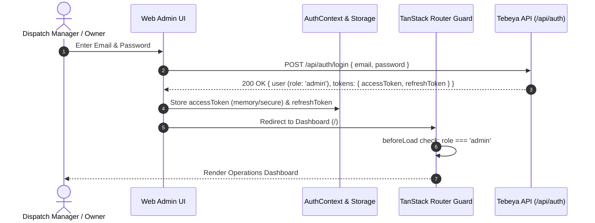
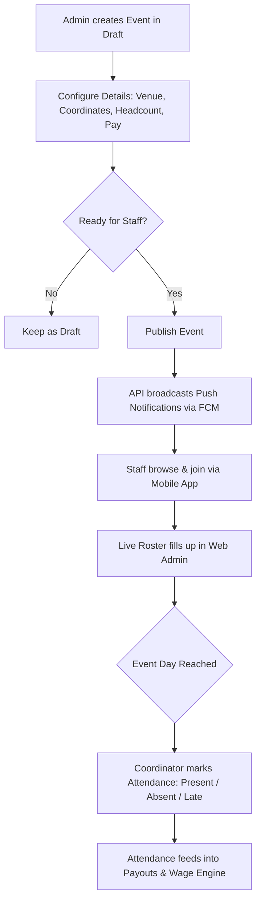

# Tebeya Services - Web Admin Portal Architecture & Specification

**Service / Workspace:** `@tebeya/web`  
**Location:** `apps/web`  
**Platform:** React 19, Vite, TanStack Router, TanStack Query, Tailwind CSS, TypeScript  
**Version:** 1.0.0  
**Status:** Active Design & Specification  

---

## 1. Executive Summary & Purpose

`@tebeya/web` is the administrative control portal for the **Tebeya Services Catering Staff Platform**. Tebeya specializes in supplying trained, uniformed banquet servers, waiters, and event staff to large-scale venues (weddings, conventions, corporate dinners, private banquets). 

While catering staff utilize the mobile application (`@tebeya/mobile`) to discover shifts and track earnings, the **Web Admin Portal** is the operational nerve center used by company coordinators, dispatch managers, and business owners.

### Primary Operational Mandates
- **Event Lifecycle Orchestration:** Authoring, scheduling, slot-mapping, headcount provisioning, and publishing catering shifts.
- **Roster & Capacity Management:** Real-time visibility into shift filling rates, manual staff additions/removals, conflict monitoring, and attendance recording (`present`, `absent`, `late`).
- **Restricted Invite Code Governance:** Generating, tracking, and revoking single-use invite codes to maintain closed, high-trust onboarding.
- **Staff Verification & Private KYC Review:** Reviewing candidate profiles, verifying contact numbers, and securely inspecting Government ID proofs without exposing KYC documents to public storage.
- **Wage Policy & Payouts Processing:** Configuring distance-based travel allowances and marking event wage disbursements.

---

## 2. Technology Stack & Key Dependencies

```
+-----------------------------------------------------------------------------------------+
|                                    USER INTERFACE                                       |
|    React 19 + Tailwind CSS + Lucide React Icons + TanStack Router (File/Code Routing)   |
+-----------------------------------------------------------------------------------------+
                                             |
                                             v
+-----------------------------------------------------------------------------------------+
|                             CLIENT-SIDE STATE & DATA LAYER                              |
|   TanStack Query v5 (Server Cache)  |  Auth Context (JWT Memory)  |  Local UI State     |
+-----------------------------------------------------------------------------------------+
                                             |
                                             v
+-----------------------------------------------------------------------------------------+
|                                  SHARED CONTRACT LAYER                                  |
|   @tebeya/shared (TypeScript Domain Models, ApiResponse<T>, ApiError, Enums)           |
+-----------------------------------------------------------------------------------------+
                                             | (REST / HTTPS with Bearer Auth)
                                             v
+-----------------------------------------------------------------------------------------+
|                                 BACKEND API GATEWAY                                     |
|   @tebeya/api (Express 4.x + MongoDB + Cloudinary Private + Firebase Cloud Messaging)   |
+-----------------------------------------------------------------------------------------+
```

### Core Technologies

| Layer / Concern | Technology | Version | Purpose & Rationale |
|---|---|---|---|
| **Framework** | React | `^19.0.0` | Latest React runtime with modern Hooks, concurrent rendering, and zero legacy bloat. |
| **Language** | TypeScript | `^5.7.3` | Type-safe code sharing with monorepo packages (`@tebeya/shared`). |
| **Bundler & Dev Server** | Vite | `^6.2.0` | Sub-second Hot Module Replacement (HMR) and optimized Rollup production builds. |
| **Routing** | TanStack Router | `^1.114.15` | Fully type-safe routing, route-level authorization loaders, search params validation, and nested layouts. |
| **Server State** | TanStack Query | `^5.67.1` | Declarative server data fetching, automatic background refetching, cache invalidation, and optimistic mutations. |
| **Styling** | Tailwind CSS | `^3.4.17` | Utility-first CSS framework enabling consistent design tokens and responsive data grids. |
| **Class Utilities** | `clsx` + `tailwind-merge` | `^2.1.1` / `^3.0.2` | Clean, collision-free conditional class concatenation. |
| **Iconography** | Lucide React | `^1.16.0` | Clean, standardized SVG icons for dashboards, tables, and actions. |
| **Monorepo Core** | `@tebeya/shared` | `workspace:*` | Canonical source of truth for domain models, request/response contracts, and wage formulas. |

---

## 3. High-Level Architecture & Workspace Directory Layout

The application adheres to a **modular, feature-sliced layered architecture** that separates presentation, data-fetching logic, and API clients:

```
apps/web/
├── index.html                  # HTML entry point with viewport & font configurations
├── package.json                # Dependencies and workspace scripts (@tebeya/web)
├── postcss.config.js           # PostCSS plugin configurations (Tailwind, Autoprefixer)
├── tailwind.config.js          # Tebeya custom palette, spacing, and typography
├── tsconfig.json               # TypeScript compiler config for frontend source
├── tsconfig.node.json          # TypeScript compiler config for Vite tooling
├── vite.config.ts              # Vite plugins, path aliases, proxy, and build settings
└── src/
    ├── api/                    # HTTP client, interceptors, and typed API endpoints
    │   ├── client.ts           # Axios/Fetch wrapper with JWT Bearer injection & refresh flow
    │   ├── auth.api.ts         # Login, refresh, logout, profile endpoints
    │   ├── events.api.ts       # Event CRUD, publish, cancel, roster fetching
    │   ├── invites.api.ts      # Invite code generation, revocation, and listing
    │   ├── staff.api.ts        # Staff directory, status toggle, KYC signed URL fetch
    │   └── wage.api.ts         # Wage rules config and payout reconciliation
    ├── components/             # Reusable UI design system primitives
    │   ├── ui/                 # Core atoms: Button, Input, Modal, Badge, Dropdown, Table
    │   ├── layout/             # AdminLayout, Sidebar, Navbar, Breadcrumbs, PageContainer
    │   └── feedback/           # AlertBanner, SkeletonLoader, ConfirmModal, Toast
    ├── context/                # Global React contexts
    │   └── AuthContext.tsx     # Current admin session, token lifecycle, role gate
    ├── features/               # Domain-specific feature modules
    │   ├── dashboard/          # Metric stat cards, upcoming shifts grid, alert banners
    │   ├── events/             # Event creation modal, event filters, event cards
    │   ├── roster/             # Live headcount progress, attendee list, attendance toggles
    │   ├── staff/              # Staff data grid, KYC preview drawer, suspension modal
    │   ├── invites/            # Invite code generator, copy-to-clipboard, status badges
    │   └── payouts/            # Travel allowance calculations, payout batch review
    ├── hooks/                  # Custom application hooks
    │   ├── useAuth.ts          # Auth context consumer
    │   └── useDebounce.ts      # Debounced search inputs for staff/roster tables
    ├── routes/                 # TanStack Router route definitions
    │   ├── __root.tsx          # Root route with global layout, toaster, and DevTools
    │   ├── login.tsx           # Admin authentication screen
    │   ├── index.tsx           # Operational dashboard
    │   ├── events/
    │   │   ├── index.tsx       # Events list & calendar overview
    │   │   ├── $eventId.tsx    # Single event detail & live roster inspection
    │   │   └── new.tsx         # Event authoring wizard
    │   ├── staff/
    │   │   ├── index.tsx       # Staff directory & verification review queue
    │   │   └── $staffId.tsx    # Detailed staff profile & past shifts
    │   ├── invites.tsx         # Invite code governance & generation console
    │   ├── payouts.tsx         # Event wage ledger & payout status marker
    │   └── settings.tsx        # System settings & global wage rule editor
    ├── types/                  # Web-specific local types, form schemas, and filter state
    ├── utils/                  # Helper utilities (date formatters, currency, distance format)
    ├── App.tsx                 # Root application wrapper with router & providers
    ├── main.tsx                # Client bootstrap mounting React 19 to DOM
    └── index.css               # Tailwind directives and custom scrollbar styles
```

---

## 4. Core Operational Modules & Workflows

### 4.1 Authentication, Session Persistence & Route Guards

Access to `@tebeya/web` is strictly limited to users with the `admin` role. 



#### Key Architecture Rules
1. **Stateless Token Management:** The short-lived `accessToken` (15m) is stored in memory/context. The `refreshToken` (30d) is held in secure persistent storage or HTTP-only cookie.
2. **Silent Token Refresh:** The API client intercepts any `401 Unauthorized` responses, executes `POST /api/auth/refresh`, updates the active token, and seamlessly retries the failed request.
3. **Route Protection:** TanStack Router uses `beforeLoad` route hooks on all authenticated routes. Unauthenticated or non-admin users are immediately redirected to `/login` with an intact `redirect` search parameter.

---

### 4.2 Dashboard & Operational Telemetry

The main dashboard provides dispatchers with an instant overview of operational readiness:

- **Key Performance Indicators (KPIs):**
  - **Upcoming Events:** Confirmed events in the next 7 days.
  - **Aggregate Roster Fill Rate:** Total seats filled vs total headcount across upcoming shifts.
  - **Active Invite Codes:** Count of unexpired, unredeemed invite codes currently circulating.
  - **Pending KYC Verifications:** Newly onboarded staff awaiting ID proof verification.
- **Action Triggers & Urgent Queues:**
  - **Understaffed Shifts:** Events within 48 hours that have `< 80%` of seats filled, highlighted with amber/rose urgency indicators.
  - **Double-Booking Awareness:** Staff members who have taken two shifts on the same calendar day are flagged so coordinators can verify proximity and travel gaps.

---

### 4.3 Event Management & Shift Rostering

Event management is the highest-volume workflow within the admin panel.



#### Operational Capabilities
1. **Event Scheduling & Configuration:**
   - **Date & Meal Slot:** Supports predefined slots (`breakfast`, `lunch`, `snacks`, `dinner`) or `custom` schedules.
   - **Time Bounds:** Explicit `startTime` and `endTime` (24-hour format). These boundaries are sent to the backend clash engine to enforce the **hard overlap rule** (`startA < endB && startB < endA`) and the **2-hour travel buffer**.
   - **Venue Geocoding:** Stores plain text address along with latitude and longitude (`lat`, `lng`) to enable distance calculations for staff travel allowances.
   - **Financials & Headcount:** Required server headcount and base `payPerPerson`.
   - **Operational Details:** Banquet dress code (e.g. "Black trousers, white formal shirt, polished black shoes, bow tie"), on-site coordinator contact information, and special client notes.
2. **Publishing Workflow:**
   - Events begin in `draft` status.
   - Transitioning to `published` makes the shift visible in `@tebeya/mobile` and prompts the backend to broadcast an `event_published` FCM push notification to active staff.
3. **Live Roster Inspection:**
   - Progress bar depicting `filledCount / headcount`.
   - Table of joined staff displaying server name, mobile number, booking timestamp, and distance from venue.
   - Visual chip indicating `acknowledgedDoubleBooking: true` for servers working two shifts that day.
   - **Manual Admin Intervention:** Admin can manually add an eligible staff member or remove a booked staff member (which atomically decrements `filledCount` and frees the slot).
4. **Attendance Recording:**
   - On the day of the event, coordinators mark each booked server's attendance:
     - `present`: Eligible for full payout.
     - `late`: Logged for punctuality tracking; eligible for payout.
     - `absent`: Flagged as a no-show; zeroes the payout and increments the staff member's no-show count.
5. **Roster Export:**
   - Quick export to CSV/printable layout for venue security desks and event head captains.

---

### 4.4 Staff Directory & Private KYC Verification

Tebeya enforces strict standards for event servers. The staff module manages the staff lifecycle from registration to active deployment.

#### Staff Status Workflow
- `pending_verification`: Initial state after invite-code signup. Staff can view upcoming events but cannot join shifts until approved.
- `active`: Fully verified staff member in good standing.
- `suspended`: Deactivated account (e.g. due to repeat no-shows or misconduct). The user is forcibly logged out and blocked from taking shifts.

#### Rule 4: Private Storage for Staff ID Proofs
> [!IMPORTANT]
> **Staff ID proof images are sensitive KYC documents.** Under monorepo invariant Rule 4, raw public Cloudinary URLs for ID proofs are never stored or exposed.
> 
> In the Web Admin:
> 1. When an admin opens a staff profile to review an ID proof, `@tebeya/web` requests a **time-limited signed URL** via `GET /api/staff/:id/id-proof`.
> 2. The signed URL is rendered in an ephemeral modal or slide-over drawer.
> 3. The client never caches the signed URL locally and does not store it in browser storage.

---

### 4.5 Invite Code Generation & Access Governance

Tebeya operates on a strictly closed, invite-only onboarding model (Rule 3). The admin portal is the sole mechanism for introducing new staff into the system.

#### Invite Code Properties
- **Single-Use Guarantee:** Each code can only be redeemed once. The backend redeems codes atomically during `POST /api/auth/register`.
- **Configurable Expiry:** Codes can be assigned an expiration window (default 48 hours).
- **Optional Phone/Email Lockdown:** Admin can lock a code to a specific candidate's phone number or email (`lockedPhoneOrEmail`). If set, registration fails if the user attempts to sign up with a different phone or email.
- **Bulk Generation:** Allows coordinators to generate batches of codes (e.g. 10 or 25 codes) for an in-person orientation or training drive.
- **Revocation:** Admin can revoke any unused invite code immediately, rendering it invalid.

---

### 4.6 Wage Rules, Travel Allowances & Payouts Processing

Tebeya calculates compensation based on event base pay plus distance-based travel allowances:

$$\text{Estimated Payout} = \text{basePay} + \max(0, (\text{distanceKm} - \text{freeKm})) \times \text{perKmRate}$$

#### Admin Capabilities
1. **Global Wage Configuration (`WageRule`):**
   - Editable parameters: `basePay`, `freeKm` (e.g. first 15 km free), and `perKmRate` (e.g. ₹10/km beyond the free radius).
2. **Payout Reconciliation:**
   - Displays all completed shifts with attendance marked `present` or `late`.
   - Computes individual staff payouts using the wage formula.
   - Coordinators can mark payouts individually or bulk-mark shifts as `payoutStatus: 'paid'`.
   - Export payout summaries to CSV for bank transfers or accounting software.

---

## 5. Data Fetching & Server-State Architecture (TanStack Query)

The Web Admin leverages **TanStack Query v5** as its primary client cache, minimizing redundant API requests while guaranteeing data freshness.

### 5.1 Query Key Factory Pattern

To prevent cache key collisions and simplify invalidation, keys follow a structured hierarchy:

```typescript
export const queryKeys = {
  auth: {
    me: ['auth', 'me'] as const,
  },
  events: {
    all: ['events'] as const,
    list: (filters: Record<string, unknown>) => ['events', 'list', filters] as const,
    detail: (id: string) => ['events', 'detail', id] as const,
    roster: (id: string) => ['events', 'roster', id] as const,
  },
  staff: {
    all: ['staff'] as const,
    list: (filters: Record<string, unknown>) => ['staff', 'list', filters] as const,
    detail: (id: string) => ['staff', 'detail', id] as const,
    idProof: (id: string) => ['staff', 'id-proof', id] as const,
  },
  invites: {
    all: ['invites'] as const,
    list: (status?: string) => ['invites', 'list', status] as const,
  },
  wages: {
    rule: ['wages', 'rule'] as const,
    payouts: (filters: Record<string, unknown>) => ['wages', 'payouts', filters] as const,
  },
};
```

### 5.2 Cache Invalidation & Mutation Strategies

| User Action | Target Mutation | Cache Invalidation Triggers |
|---|---|---|
| **Publish Event** | `publishEvent(id)` | Invalidate `events.all`, refetch `events.detail(id)` |
| **Cancel Event** | `cancelEvent(id)` | Invalidate `events.all`, `events.roster(id)` |
| **Mark Attendance** | `markAttendance(bookingId, status)` | Optimistically update `events.roster(id)`, invalidate `wages.payouts` |
| **Verify Staff KYC** | `updateStaffStatus(id, 'active')` | Invalidate `staff.all`, `staff.detail(id)`, dashboard counts |
| **Generate Invite** | `createInviteCode(payload)` | Invalidate `invites.all` |
| **Revoke Invite** | `revokeInviteCode(id)` | Invalidate `invites.all` |
| **Mark Payout Paid**| `markPayoutStatus(bookingId, 'paid')`| Optimistically update `wages.payouts`, invalidate `events.roster` |

---

## 6. Routing Architecture & Page Map

The navigation structure implemented via **TanStack Router**:

```
/                           -> Dashboard (Operational Overview & KPIs)
/login                      -> Admin Login Form
/events                     -> Events Management
  ├── /                     -> Calendar & Filterable Events Grid
  ├── /new                  -> Event Creation Wizard
  └── /$eventId             -> Event Details, Capacity Progress & Live Roster
/staff                      -> Staff Management
  ├── /                     -> Filterable Staff Directory & KYC Review Queue
  └── /$staffId             -> Staff Profile, Attendance History & KYC Drawer
/invites                    -> Invite Code Generator & Governance Console
/payouts                    -> Attendance Reconciliation & Payout Ledger
/settings                   -> Wage Rules & System Settings
```

---

## 7. UI Design System & Component Guidelines

The interface utilizes a clean, high-density layout designed for rapid data scanning:

### Color Palette & Semantic Roles
- **Primary / Brand:** Emerald (`emerald-600` / `emerald-700`) — represents positive operational health, filled rosters, and confirmed statuses.
- **Neutral / Surface:** Slate / Gray (`gray-50` background, `white` cards, `gray-200` borders, `gray-900` text).
- **Warning:** Amber (`amber-500` / `amber-50`) — indicates tight capacity, travel buffer warnings, and late attendance.
- **Danger:** Rose (`rose-600` / `rose-50`) — indicates schedule conflicts, absent staff, cancelled shifts, and revoked codes.

### UI Status Badges

| Domain Entity | Status | Badge Appearance |
|---|---|---|
| **Event** | `draft` | Gray background, slate text |
| **Event** | `published` | Emerald background, dark emerald text |
| **Event** | `completed` | Blue background, dark blue text |
| **Event** | `cancelled` | Rose background, dark rose text |
| **Attendance** | `present` | Emerald pill with solid dot |
| **Attendance** | `late` | Amber pill with warning icon |
| **Attendance** | `absent` | Rose pill with cross icon |
| **Attendance** | `pending` | Gray pill with clock icon |
| **Staff Status** | `pending_verification` | Amber badge with pulse indicator |
| **Staff Status** | `active` | Emerald badge |
| **Staff Status** | `suspended` | Rose badge |
| **Invite Code** | `active` | Emerald badge |
| **Invite Code** | `used` | Gray badge |
| **Invite Code** | `expired` | Rose badge |
| **Invite Code** | `revoked` | Gray badge with strike-through |

---

## 8. Development, Verification & Build Workflow

### 8.1 Package Location & Scripts

The admin portal is located at `apps/web` with package name `@tebeya/web`.

```bash
# Start local development server with Vite (runs on http://localhost:5173)
pnpm dev:web
# (or legacy alias)
pnpm dev:admin

# Typecheck web workspace
pnpm --filter @tebeya/web typecheck

# Production build
pnpm --filter @tebeya/web build

# Preview production build locally
pnpm --filter @tebeya/web preview
```

### 8.2 Environment Configuration

Environment variables are defined in `apps/web/.env` and loaded by Vite via `import.meta.env`:

```env
# API Gateway URL
VITE_API_BASE_URL=http://localhost:5000/api

# Application Metadata
VITE_APP_TITLE="Tebeya Services - Admin Portal"
```

---

## 9. Architectural Invariants for Contributors & Agents

When maintaining or extending `@tebeya/web`, you **must adhere to these invariants**:

1. **Shared Types First:** Never declare duplicate types for backend domain entities (`CateringEvent`, `Booking`, `User`, `InviteCode`, `WageRule`). Always import them from `@tebeya/shared`.
2. **Server-Side Authority:** The web admin is a client of `@tebeya/api`. Never duplicate backend validation logic (such as clash detection or atomic seat counts) on the client with the expectation that client state is authoritative.
3. **KYC Privacy (Rule 4):** ID proofs must never be loaded from public URLs or cached permanently in client memory. Use the signed temporary URL flow provided by the API.
4. **Clean Builds:** Ensure all changes pass `pnpm --filter @tebeya/web typecheck` and `pnpm --filter @tebeya/web build` without TypeScript errors or broken imports before submitting changes.
